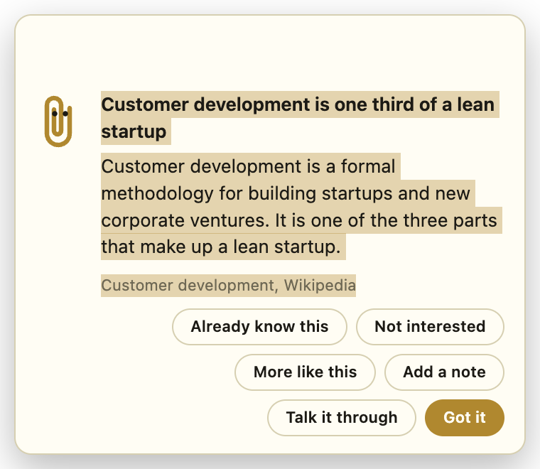

# TimerBar

A macOS menu bar timer with two modes and a coach that only talks when you are not working.

In the menu they are one radio group, Freebasing at the top and the eight timer lengths under it, so exactly one is checked at a time. Picking Freebasing stops the timer, running or flashing, and picking a length starts one, which is also how you restart the one already running.

**Timer running.** Pick a length from the menu, five minutes to ninety. You give the session a label, it counts down next to that label in the menu bar, and it flashes when you hit zero. No tips interrupt you while the clock is running, though the power and goal cards still come through, since both are about the session you are in rather than a distraction from it.

**Categories.** Every session is filed under a category of work. The menu lists them as a radio group under the timer lengths, Work, Side project and Life admin until you change them, and **Edit categories…** opens a card where each one gets a name and a color. The palette is seven of the eight colors the menu bar can paint behind text, white left out because it is a background on a background, each paired with black or white ink so the chip reads on a light bar and a dark one alike. While a timer runs the countdown wears the active category's chip, and switching category mid-session takes effect at once. Every segment goes to `focus-log.jsonl` in the app's user data with its start, end, category, task label, planned length and how it ended: `completed` when the timer ran out, `stopped` when you picked Freebasing, `switched` or `relabelled` when you changed category or task mid-session, `restarted` when you picked a new length, `quit` on a clean exit, and `lost` when the app was cut off, in which case the next launch closes the segment at its last heartbeat, written every fifteen seconds. **Focus time** in the menu reads that log back as today, this week from Monday, this month and all time, each with the total and the split per category, and can reveal the file for any analysis of your own. Only time with the clock actually running is counted. Freebasing and the flashing after a timer expires belong to no category and add nothing to any of them, since the segment closes the moment the timer hits zero.

**Goals.** Each category carries a share of your timed work, set as a percentage in the same card. Everything is measured over the goal period, which begins the moment you save a split and runs until you change it. Earlier periods are recorded in `categories.json` with the shares they held, as the raw material for a later look back rather than anything the app reads today. Renaming, recoloring, adding or removing a category leaves the period alone, only a changed share opens a new one, and the card says which day the current one started before you touch anything. The shares are weights rather than a budget, so they are normalized over the categories that have one, and the card only refuses a split that adds up past 100. A category at 0% is kept for its history but drops out of the menu and out of the goals, which is how a category is retired without losing what it recorded. The card opens with the rows ordered by share, biggest first, so what you are asking most of is at the top and anything retired sits at the bottom. Rows added while the card is open stay where you put them until it is reopened.

The **Focus time** submenu opens with the goal block: the period's total and each category as the share you actually gave it against the share you asked for. The category list in the menu is sorted by that gap, most starved first, so the top one is always the one to pick next. That ordering is the whole of the nudge in the ordinary case, since the menu is not the place for numbers.

When the gap gets wide the coach says so out loud. Starting a session in a category that is ahead of its share, or reaching the end of one, brings up a card naming the category furthest behind and asking you to point the next session at it. It never switches anything for you. Two gates keep it quiet: at least eight hours logged in the period, so a fresh split cannot trip it, and at least ten points of gap, so being close to target is left alone. It comes at most once an hour for as long as the app stays up, and **Talk it through** opens a session with the whole ledger to work out whether the split itself is still right.

**Freebasing.** No timer and no goal you are held to, just the coach's cards and whatever the wandering ADHD brain lands on next. It is a mode you pick on purpose rather than the absence of the other one, because creativity tends to come out of that chaos. A Clippy-style card slides into the corner every four to twelve minutes with one idea, drawn from 366 tips distilled from free sources. It sits above every window and every space until you press Got it, so it survives switching apps. Talk it through opens a Claude Code session seeded with that tip so you can argue with it. Already know this and Not interested retire the card for good. More like this keeps the card in play and counts as a vote for more in that direction. The title, the body and the source are selectable text, so one drag from the top of the card to the source takes all three, a right click offers Copy and Select All, plus Copy Link when the click is on the source, and the moment a drag or a double click has selected something the card asks for keyboard focus so that Cmd+C lands on it rather than on the app behind. Whenever the source is part of what you copy, its address goes on the last line. Once the card has focus, Escape closes it, and closing it hands focus back to the app you came from.



Each card carries a beacon along its top edge, there to catch an attention that drifts. It is a small canvas animation in phosphor green, picked at random from Matrix rain, a decode marquee and a port scan log, or a spectrum analyser when something is playing audio at half volume or louder, or at any level through an output that reports no volume of its own. The three random ones invert the whole strip 2.5 times a second and the analyser slams every bar to the top at the same rate. Hover the card and the beacon goes dark so the tip can be read in peace.


The tips cover three subjects, 122 cards each: building a SaaS, the psychology of attention, motivation and habit, and the psychiatry around working with your own head. Cards rotate through the subjects in turn, so each gets exactly a third of the airtime whatever is left in its pool. Inside a subject the definitions come first, what SaaS, psychology and psychiatry even are and the vocabulary the other cards lean on, then the rest in a shuffled order. Each subject seeds a different conversation when you press Talk it through, and the psychiatry one is told to stay inside its source, avoid diagnosing, and name when something belongs with a doctor.

Every card you see is recorded in `feedback.json` in the app's user data, keyed by title, with its subject, how many times it has shown, the status you gave it, and how many times you asked for more like it. Retired cards never come back, a subject whose cards are all retired drops out of the rotation, and when nothing is left the tune-up card takes over. Cards you asked for more of keep coming round, the count survives a later known mark, a later Not interested mark wins over it, and both the tune-up and the quiz read those cards as the places to go further.

That session starts in `/tmp`, and its prompt names TimerBar's own checkout, so an argument about a tip can turn into a change to the coach. A packaged build learns that checkout path from the first run out of the source tree, because the bundle only knows its own location inside `/Applications`.

Once a week the usual tip is replaced by a tune-up card. Acting on it opens a Claude Code session that reads your recent session transcripts and the feedback file, works out what you have actually been building, what you already know and what you asked for more of, interviews you about your goals and where you are stuck and how your attention, sleep and stress have been, and writes a new edition of the personal cards and the book around your situation, spread evenly over the three subjects. Until you run it, it is the only card you get.

**Quiz me…** in the menu is there whenever you want it, timer or not. It opens a Claude Code session that reads the card pool, your feedback file and the earlier sessions in `quiz.json`, asks which topics you want today, and quizzes you one question at a time on cards you have seen, definitions first. Cards you clearly had get marked known so they stop coming round, and the session ends by writing a new edition of the personal cards and the book around what you missed, what follows from the cards you asked for more of, and what comes next in the topics you asked for. The card pool is copied to `tips-builtin.json` in the app's user data on every launch so the session can read it out of a packaged build.

**Read the book…** opens a reader for the editions in `library/` in the app's user data. Every session that rewrites the personal cards, the weekly tune-up, the quiz and the reader's own **Write a new edition** button, writes a numbered pair of data files there: `cards-000N.json`, the popups the coach shows from then on, and `book-000N.json`, about two hours of reading in ten to twelve chapters written from the same material, the cards you asked for more of, what you marked known, what the quiz caught you out on and the notes you left on the earlier editions. The book is for when the popups cannot reach you, a flight or a train with no network, so it is written out in full and the links are citations only.

The reader pages through it a chapter at a time, with a contents list and the arrow keys, and every section has a Highlight toggle and a comment box. Those go to `notes-000N.json` beside the book they belong to, and the next edition reads them: a highlight asks for more in that direction, a comment is an instruction. The reader also keeps `reading-000N.json`, the chapters you finished. A chapter only counts once you have paged past it, a Finish the book button stands in for the page after the last one, and the contents list ticks the ones that count. The next edition reads that too, since an edition you stopped partway through was too long or off target, and it is told to say which. Nothing in `library/` is ever overwritten, so old cards, old books and the notes on them stay as the record of where you were, and the edition picker in the reader goes back through them. The button opens one Claude Code session that asks one question, what to lean into, then writes both files, and the reader picks the new edition up the next time it is focused. A `tips-personal.json` left by an earlier build becomes `cards-0001.json` on the first launch.

**Power draw.** On battery the menu bar shows the draw the app is watching: the median of the readings taken every thirty seconds over the last five minutes, the same number it compares against the 22 W limit. It sits in the flame's slot, drawn in the menu bar's own text colour, and from 100 W the decimal is dropped so it still fits. Under the limit it is just the number. Over it the flame flashes in the number's place, swapping in and out every half second, and once that median has a full five minutes of readings behind it, a card asks you to plug in at places you have marked as having a charger within reach. A second card comes up at those places when the battery drops under 40 percent. Plug in and the slot disappears, since the battery current then measures charging rather than the machine.

## Where the tips come from

All free, all downloaded and distilled in `resources/`:

| Source | Subject | Tips |
| --- | --- | --- |
| [Getting Real](https://basecamp.com/gettingreal), 37signals, all 91 chapters | SaaS | 88 |
| [Paul Graham essays](https://paulgraham.com/articles.html) | SaaS | 16 |
| [SaaS Starter Stack](https://github.com/timb-103/saas-starter-stack) | SaaS | 4 |
| [Open SaaS](https://opensaas.sh/) | SaaS | 2 |
| [Wikipedia](https://en.wikipedia.org/) article summaries, 244 concepts | SaaS, psychology, psychiatry | 244 |
| [NIMH](https://www.nimh.nih.gov/) and [NHLBI](https://www.nhlbi.nih.gov/), public domain | Psychiatry | 12 |

The corpus itself is not redistributed here. Regenerate it with `python3 resources/fetch.py && python3 resources/extract.py && python3 resources/build-tips.py`, which downloads the sources, strips them to text and rebuilds `src/tips.json`. Every tip keeps its source and a link back, so the provenance is checkable rather than invented.

Wikipedia arrives through the REST summary API, one lead paragraph per concept, which is already the shape of a card. NIMH and NHLBI pages are US government work in the public domain and say so on the page, which is why the health tips can quote them closely and only need the citation. The card titles are the one editorial layer: they frame the idea, the body underneath is the source. None of it is medical advice, and the cards that touch clinical ground point at getting a professional rather than substituting for one.

## The problem it solves

The original app was a countdown and nothing else. The gap it left is that the menu bar is the one surface you stop looking at the moment you stop working, which is exactly when a nudge would land. TimerBar inverts that: it is quiet while the timer runs and only speaks when the timer is off.

That has a measurable failure mode. When another app is fullscreen the menu bar is gone entirely, so the timer is invisible and the app is silently useless. TimerBar detects that case and shows the card anyway.

## Findings worth writing down

- **`workArea` does not change under fullscreen.** The obvious way to detect a hidden menu bar is to compare `screen.getPrimaryDisplay().bounds` with `workArea`. On macOS both are identical whether or not an app is fullscreen (`y: 33, height: 1084` in every state measured), because the values describe the primary space, not the active one. The working detection is an Accessibility query for `AXFullScreen` on the frontmost process's windows.
- **That query costs 464 ms.** Run synchronously on the main process it stalls the countdown and every animation. Measured with a 20 ms interval counter: 20 ticks fired during the check once it was moved to async `execFile`, against the roughly 23 expected, versus a hard stall before. Any AppleScript bridge belongs off the main thread.
- **A tray-only Electron app quits itself the first time a window closes.** With no `window-all-closed` handler, Electron's default is to quit. The app had no windows at all before, so the bug only appeared once the first popup was dismissed, and it took the whole menu bar item with it.
- **`focusable: false` is what makes an interrupting popup tolerable.** The card appears while you are typing. Without it the popup steals the keystroke you were mid-way through. The cost is that such a window can never become key, so a selection made in it with the mouse cannot be copied with Cmd+C: the keystroke goes to the app that is still active. The card therefore flips itself focusable through `setFocusable(true)` and asks for activation only once text has been selected, and a right click offers Copy for the case where macOS declines, since Sonoma honours an app activating itself only on the back of a real user event. A focused card also holds Cmd+Q and Cmd+H, which under Electron's default menu would quit or hide the whole app, so the application menu is trimmed to Edit and Close, a focused card hides the app as it closes so that focus returns to where it was, and the card turns unfocusable again the moment focus moves elsewhere.
- **`'screen-saver'` is the always-on-top level that clears fullscreen apps.** `'floating'` is not enough, and `visibleOnFullScreen` has to be set through `setVisibleOnAllWorkspaces`, not the constructor.
- **`InstantAmperage` from `ioreg` is a 64-bit two's complement value, and `Number` cannot hold it.** On battery the current is negative, so it arrives as an unsigned integer just under 2^64, where JavaScript doubles are spaced 2048 apart. Parsed with `Number`, every reading rounded to a multiple of 2048 mA, so the app only ever saw 0, 24 or 48 W and the 22 W threshold was really tripping at about 12 W. `BigInt.asIntN(64, ...)` recovers the exact value.
- **A tray title that changes width shifts every menu bar item to its left.** The flame prefix flashing in and out moved the rest of the bar by about 23 points twice a second, and the system font's proportional digits moved it by up to 9 points on every tick of the countdown, since `11:11` is narrower than `00:00`. The title is set with `fontType: 'monospacedDigit'`, and anything that flashes is a tray image of fixed size. `swift scripts/render-flame.swift` regenerates the flame bitmaps from the emoji at the menu bar font size, and `swift scripts/render-glyphs.swift` renders the digits, the dot, the space and the W with the monospaced-digit system font the title uses. `src/readout.js` composes the wattage from those glyphs at runtime into a slot the width of `00.0 W`, flagged as a template image so macOS paints it in the menu bar's own text colour, and centres the flame in a slot of the same size, so flashing swaps two images of one size. Measured with `tray.getBounds()`, `00:00` and `11:11` come out at the same width, and so do `9.8 W`, `99.9 W`, `120 W` and the flame.
- **`pmset -g assertions` knows when audio is playing.** While any app has an output stream open, `coreaudiod` holds a `PreventUserIdleSystemSleep` assertion whose resource line starts with `audio-out`. That one shell call, next to `get volume settings` from `osascript`, is enough to tell loud music from silence without a private framework.
- **macOS 26 redacts the Wi-Fi name from every command line tool, but leaves it inside `scutil`.** `networksetup -getairportnetwork`, `ipconfig getsummary` and `system_profiler` all print `<redacted>` or claim there is no network unless the caller has Location Services access, which an Electron main process has no way to ask for. `scutil` blanks `SSID_STR` in `State:/Network/Interface/en0/AirPort` as well, but the `CachedScanRecord` next to it is an `NSKeyedArchiver` plist of the access point the interface joined, and its `SSID_STR` is intact. The app decodes that with a small binary plist reader and only falls back to the DHCP domain name, which is why the charger menu item used to read `fritz.box`: that is the domain a FRITZ!Box hands out, not the network name.
- **Wikipedia's REST API rate-limits a generic User-Agent.** Fetching a few dozen summaries as `Mozilla/5.0` worked, and fetching two hundred returned 429 for most of them. A descriptive User-Agent naming the project, as their policy asks, let every request through at the same pace.

## Install

The landing page at [timerbar.pascu.be](https://timerbar.pascu.be), served from Cloudflare Pages where it also answers as [timerbar.pages.dev](https://timerbar.pages.dev), links the latest dmg and walks through the first launch, which macOS refuses until you allow the ad-hoc signed build in Privacy & Security or clear its quarantine flag. The page is `site/index.html`, with its favicon, `robots.txt` and `llms.txt` beside it, and `pnpm site:deploy` stages them with the card screenshot and publishes through a `wrangler` you have installed and logged in. The build names the dmg `TimerBar.dmg`, without a version, so the page's download link stays the same across releases.

To build from source:

```bash
corepack enable
pnpm install
pnpm start          # run from source
pnpm test           # unit tests over the pure modules
pnpm run build:mac  # produces a dmg in dist/
```

Node 22.x, as pinned in the `engines` field.

Start at login defaults to off. The app offers it once on first run, and it is scriptable:

```bash
/Applications/TimerBar.app/Contents/MacOS/TimerBar --enable-login-item
/Applications/TimerBar.app/Contents/MacOS/TimerBar --disable-login-item
/Applications/TimerBar.app/Contents/MacOS/TimerBar --status
```

The fullscreen card needs Accessibility access in System Settings, Privacy & Security. Everything else works without it, and the log says so when the check is refused.

Logs rotate at 1 MB to `~/Library/Logs/TimerBar.log`.

---

## How this was built

Every prompt in the session that produced this app, verbatim and in order, typos included.

1. donwload free resources on how to build a saas, and make random important information randomly pop into my coputer via pop ups, similar like clippy, every random idk how long time, when I am active at the computer, and don't have the timer turned on, see menubar timer, actually make this a menubar timer feature, have a stop timer button, and that enables these random popups about how to build a saas, a new claude skill is being built, wait for it to appear, it's the how to publish as a prod app skill invoke it for this project menu bar thimg. Also make it autostart same way like the other app that is built via this productionize app skill, you can talk tha tsession and ask for details, its a sibling session that is active now

2. also make the menu bar clock have a field where I can input what I am working on, it will always show that text, next ot the time

3. also make it ahve two modes of operation, can be toggled, one of them is when I am seeking flow in an active task, meaning I have the popup and the timer also gets triggered, or when off. Basically when on it needs to count down, flash like now when 0, and requires a label for tha tthing I am working on, in this mode it will not shop popups with tips, when timer is off, then it shows the tip popups, it should also show popups with tips when it ran out of time and is staying in a flashing state

4. Also make it show a popup when the timer is off, and the re is a fullscreen window hiding the bar that contains the timer

5. Also render the popups in a way that they are oerlayed on everything, meaning that even whole I switch woindows and am active with the computer this popup will be there untill I dissmiss it by pressing ok, also add a button on it titled something else, make this other button to open a claude code cli session where the initial prompt is the tip, and I can ask followup questions the tip shown, when either button is clicked, the thing dissapears

6. once every week, have the popup instead of showing the usual stuff, have a special one that when acted upon will invoce claude code cli in a way that it will learn things from past weeks or since this was ran claude code sessions, all sessions from disk with relevant dates or last activity, learn what I am doing overall and then adapt the tips to my current situation to drive me to better undertand how to make money with saas, just take me from where I am to where I want to be, this cli code session will aslo ask me questions about my goals, and anything else needed to have better tooltips for me to learn to reach goals and whatever else we talk about in this session, make sure it asks where i struggle as well and take my situation into consideration, make it gather as much context about me as needed to have efficient relevant popups, make sure this is scheduled, once more than 7 days pass, this will be the only popup type shown

7. also add an mcp server that can send notifications to my mobile on command, I think that will be useful later on

   *Two multiple-choice answers followed here, choosing the notification channel and where the server should live. Not counted as prompts.*

8. the tooltips seem to dissapear by themselves very quickly, make sure they work proper

9. use the [ublish app skill that is actively authored, idk if done, wait for the skill to exist first, when it exists, use it to publish the app on my website etc

10. *An unrelated one-line clipboard request about a third party's order. Withheld here rather than published, since it concerns someone who did not agree to appear in this repo. It is counted as a prompt.*

11. phone pluggied in

12. 3Mmake the menu bar timer show low battery popups all the time when abttery is either draining quickly like today , or even better maybe when sustained cpu load is high and we are on battery, also make it show generally when battery is low under 40 percent. make these show often every few minutes in all states of the timer, when its off, on or even timed out, make it work with both low battery and sustained high power consumption (better use power comsumption, total consumption, gpu, cpu led etc better than battery percentage.

13. High power consumption means sustained higher than just normal desktop operation, meaning more than just browseing the web or doing light coding for some time idk, use best practices so I plug it in.

14. Under light load I don't care much

15. Make sure it also has the same prompt button where we can promt claude to adjust this feature etc

16. again, like the other apps this skill make, make sure this auto starts same config

17. backlog to consolidate these into a superapp for adhd or second life management, put this under business ideas in notion tasks

18. see the second life task

19. btw I stil don't see that label thing I asked about

20. done?

21. remove any old apps, make sure latest is running

22. publish everything and have last version installed

23. *A one-line reply confirming the withheld prompt 10 had been dealt with. Withheld for the same reason as prompt 10, and counted.*

24. resume the session where we worked on menubar timer, make it also show tooltips about psichology and psychiatry, make sure to commit and publish the new changes

25. on the menu bar timer app, make the poipup contain a permanent flashing element that I can't hide, make the flash frequency sufficiently high , more than 1hz for sure, make it trigger somebody with adhd by visual stimulus

26. also add an ability to snooze the overheat by 10m when on battery

27. Make sure to reinstall and restar the app

28. ok, now what is causing our system load?

29. what about now?

30. I want my mac to have some location specific warnings when going low battery, it should beep and say low battery only when either at HSBXL, or home. It can determine location easily based on wifi. Brainstorm solutions

31. what was this session about?

32. we folded this into the menu bar project, get up to date with whats there, and then update it to also have the current wifi marked as a place where a charger is available and should alert

33. get up to date by browsing other claude sessions on the topic first

34. See what the other sessions did , make sure to commit everything over multiple commits

35. Whats the current logic for the pull in popup?

36. /mr-new /mr-polish and merge it in when done, have a single button for ok, no snooze.

37. also reinstall the app to ahve the new update

38. Is the Heavy load threshold good? Adapt this to my model mac

39. How quickly does load at exactlty the Heavy load threshold kill a full 100% battery on this machine?

40. /mr-new /mr-polish make a new MR to reserve the possible dynamic elements in the bar, like the fire icon and anything else that can spontaniosly pop in, right for example the fire icon causes the rest of the menu to reflow and it's very jarring

41. finish /mr-polish and merge it in

42. make sure to reinstall latest app version

43. On the popup, I want a nicer animation, make it something more hacker like

44. The one that is meant to grab attention for somebody with ADHD

45. /mr-new and /mr-polish with a new animation, add a preview gif into the MR description

46. Before that actually make a few animations in a claude artifact and let's pick the best one

47. Don't use A, only use Spectrum when music is playing relatively loud, use the rest randomly.

    /mr-new /mr-polish and merge it in, when done reinstall the app to have latest update.

48. also in this MR, make the animation dissapear when the popup is hovered, so I can read the tooltip in peace

49. /mr-new /mr-polish and merge to make sure that 22W limit works correctly, when done reinstall the app

50. /mr-new /mr-polish and merge in and reinstall app,  instead of flow mode and all timers, just have a no timer mode, and only one is checked at a time, no timer mode is basically what we have now when flow mode is disabled, use a different name for this, call it freebasing or something (since it will be chaotic, no goal is being kept, we get the popups, we;re doing random ADHD stuff etc). This might be something we want since creativity can happen more in this chaotic state

51. resume

52. /mr-new and /mr-polish and merge in and reinstall app, make Charger Avialble at x actually show wifi SSID name, idk where the current fritz.box entry comes from, because that is not my wifi name

53. resume

54. "Wealth is what people want, not money" — Paul Graham, https://paulgraham.com/wealth.html

    You make wealth by making something people want. Money is just a way of moving wealth around, so measure yourself by the thing you made, not the round you raised.

    That tip just popped up while I was working. Help me think it through and work out what it means for the SaaS I am building. Ask me what I am building before you give advice.

    The popup came from TimerBar, a menu bar coach I built myself and keep changing, so if this turns into a change worth making to the coach we can go and make it. Its source is at /Users/adrian/repos/menubar-timer.

    *Written by the coach itself, from the Talk it through button on a card. Counted.*

55. in this better, I am missing the point

56. what is the % of popups for each topic now?

57. exit any claude worktrees from this session

58. add more, I want to have an equal spint for each type

59. also add a button, similar to I know this already, or another button for I'm not interested, rename these into best practices for buttons and keep track of the status for each tooltip, so when we retrain we take feedback into account

60. another /mr-new /mr-polish , add a button into the menu bar, called quiz mode or something similar best practice name for this new menu button, this is always available, when clicked it opens a claude code session to quiz me on my knoledge based on tooltips and topics of interest, it then takes into account previous feedback stats, my quiz result and more and retrains things and sets new popups in place to make sure I progress learning topics of interest and cover any gaps. Merge this in when done.

61. Also make sure there are tooltips with definitions on what we are learning as well, I might not know the definitions of what things like psychology even is, do this in first MR

62. /mr-new /mr-polish and merge it in with the new changes

63. resume

64. anything else to remianing to do?

65. is my pc still over 22?

66. check the current state and condition etc

67. /mr-new /mr-polish show avg power draw all the time in the widget (show the same number that is used for the calculation), and only flash the flame when over limit

68. make that power reading and the fireball take the same spot, fireball flashes over the power reading /mr-new /mr-polish and merge, update installed app as well

69. /mr-new /mr-polish and merge it in, add another buttin to the popups with tips to show that I am interested, use the best practice name/label for this button and make sure to track this into stats as well When done, merge in the MR

70. resume

71. resume.

72. make sure to reinstall the app to have latest updates

73. do this /mr-new and /mr-polish and merge in another MR that will elable text selecton in the popup so I can copy parts of the popup, also make this copy pastable across both title and content parts at the same time, so I can copy the entire thing, desc, sources all in one copy paste selection. Add UI screenshots before and after this change into the MR descriton, when done restart app.

74. Btw, I like the customer development is one third of a lean startup tip, I am interested in more, add +1 on this just for my machine right now, in its data folder etc, thank you.

75. add a doc about our mascot, he's called flashy, he is is clippy's more scucesful cousin, he plated himself in pure gold and likes to show off how much he knows (not humble at all). He is the one giving the popups. /mr-new and /mr-polish

76. /mr-new /mr-polish add a feature to switch between multiple animation presets for the popup, cater to different demographics, make sure to have the picked demograhics reflect popular ones in age group of young professionals. (make sure gender is also taken into account somehow) Build out the animations themsleves for each, and keep the current one, give it a custom name, this will be the only one just based on the author's personality (me) and not any target demographics. note to self for later: check if the preset names are good

77. do not name the demographics directly into the preset names, just use something that is most suitable preset name for them.

78. /mr-new /mr-polish rename the app and project itself something that is most in line with the age gap and main target democraphic is

79. /mr-new /mr-polish Make the thing have a hidden stuff that gets copied into the text in between the title and content, make it hidden text that will show on paste (normally or like the rest of the text). In here just add the domain on where the app is hosted (it's landing page) actually build a landing page for it first, something under .pascu.be for now (configure that using cloudflare). and have that landing page also in the MR, /mr-polish and merge in, make sure landing page shows up as expected after all lands and is merged in. Keep the MR with the hidden stuff that gets copied in separate, also with it add an opt-out setting in the settings to amke this dissapear yet make the setting default it to on. This separate MR /mr-polish ye don't merge in. So first MR that gets merged in will have the landing page stuff, just not reffered to it via hidden field.

80. I am preparing to board a flight, add a feature to download as much relevant content as I need as a generated book, add a menu to paginate and to hilight different sections and to add comments, these comments will be used to further iterate on this.

    Based it on my current feedback you have so far, and when regenerating, add an updated version of the book as well, keep old books and their notes as historical

    /mr-new /mr-polish  merge in and reinstall app with this feature

81. Generate this book when regenerating the popups, add a dedicated button to kickstart this process

82. Generate a new version of the book and regenerating the popups at the same time, add a dedicated button to kickstart this process.

83. THis probably also involves separating the popup and book conent from the app itself, these will be data files.

    Also keep old popups in history when removed or edited similar to old books.

84. Make the book be about for 2h of reading.
    make sure to track how much of it was read, only count passed pages as finished, track this metric to be used by the regenration feature

85. /mr-new /mr-polish and merge

    I want to track my time spent under different categories of work, for example Freelance, latindance.be business, unemployment process.

    I am looking at total focus time for each and the splits for each. I have specific goals for different periods of time, so make sure this is tracked as granular as possible as I might want to change the stat analysis later.

    Make the labels customizable yet easy to switch later. Make each alter the color of the timer itself, allow me to pick the color as well as the name for each, have a simplified color pallet to pick from that is visible well on the bar for both dark and white display modes.

    Merge the mr when done

86. Make sure in my installed app, I have the UMP label first.

    Then Freelance second.

    Then latindance third.

    Make sure these are not hardcoded, just set them via app config/settings in my install.

    (yes this means installing the latest app as it is).

    /mr-new /mr-polish and merge, have a settings panel to set the goals for each as a percentage split. Have this over a window with a start date of now.

    Set the splits on my tasks as Freelance 20%, UMP 20%, Belgabot (add in new) 10% and the rest for latindance.be.

    Let's brainstorma. bit before implementing if these should be calcualted over a rolling window or something else. Also when  I am really of on one of these, make the popups appear informing me that I need to switch and suggest what to switch to.

87. let's do the brainstorming here now in chat

88. Also add 10% time spent in process improvements for me (this is stuff like buying equipment, uprading notion, menu bar etc)

89. quality of life / quality of work things

90. pause the work so we can brainstorm together

91. let's continue brainstorming

92. only when timer is running, that is the only focus time I care about. Also make sure to order the options in the menu in the recommended order. basically first on what we're low on, thats the lowest nudge level that always should exist.

    idk what lookback is best and what start date, keep in mind I will periodically adust the percentage splits to suit current needs.

93. pause and let's finish the braoinstorming first

94. Make the lookback just be the exact time as the entire goal period, only do the nudge if we have sufficient data and sufficient percentage off to nudge. I don;t want to get nudget to early when we are close to goals or have insifucient measurements.

95. You decide, do the best practice UI/UX for this: How you enter the split

96. What the card offers: yes, it should tell me to switch, it should not switch to me. What the menu shows next to the name: nothing new, only use the color scheme, space in the menu is precious. A new category with no goal yet: yes sounds good, don't even show it anywhere else if the goal is 0%

97. keep it paused, let's finish the brainstorming together, what info do you still need to know?

98. changing it on the day is enough, yes, changing it on the day is enough

99. Does 0% also hide it from the menu radios? yes

    I am too tired to decide on more brainstorming topics, leave the rest as backlogged tickets to reconsider later and so far you do the best practice decision. FInish everyhting and emrge in MRs and make sure teh app is installed with the splits and goals I asked for.

100. Btw, when the timer is expired, count it as freebased time so neither of the categories is active

101. I mean if timer is expired, don't add time or percentage to the active selected goal thing or category thing etc

102. /mr-new /mr-polish and merge, when reopening that set categories menu thingy, make them be sorted by the current percentage values. merge in this MR when done

102 prompts. 2 multiple-choice answers. 0 lines of code written or edited by a human.

Redactions: prompts 10 and 23 are withheld as unrelated to this project and concerning a third party's private affairs. Nothing else needed masking.

Prompts 1 to 10 produced the app as published. Prompts 11 to 23 added the power alerts, single instance enforcement, the ad-hoc signing identity fix, and cleaned up two stale builds that had been shadowing the real one in the menu bar. Prompt 24 widened the coach past SaaS into psychology and psychiatry, which meant a second and third corpus, a topic on every tip, a draw order that keeps the three mixed, and a different conversation behind the second button for each. Prompts 25 to 29 added the beacon and the overheat snooze, then chased a system load question that turned out to be partly this app leaking its own popups. Prompt 30 was a standalone brainstorm a week before the rest, and prompts 31 to 34 folded it in as charger places: the power alerts now only fire on networks marked as having a charger within reach, markable from the menu, with the place list kept out of the repo in the app's user data. Prompts 35 to 39 took the snooze back out, leaving the power card with OK and the discussion button, and the threshold question turned up that the amperage parse had been rounding every reading to a multiple of about 24 W, so the alert was tripping at half the intended draw. The reading is exact now and the threshold is derived from the battery's design capacity: it fires once the sustained current would drain a full battery in under four hours, about 25 W on a 16 inch M5 Pro. Prompts 40 to 42 stopped the menu bar reflowing: the flame became a fixed-size image slot, the countdown digits went tabular, and the result was merged and reinstalled. Prompts 43 to 48 replaced the beacon: an artifact lined up five candidate animations at the popup's real size, three of them now play at random, the spectrum analyser is held back for when music is loud, and the strip goes dark while the card is hovered. Prompt 49 put the limit back to a fixed 22 W, compared against the exact reading, so the number in the knob is finally the number the alert fires at. Prompts 50 and 51 turned the flow mode toggle into a radio group: Freebasing at the top, the timer lengths under it, exactly one checked at a time, with Stop timer folded into picking Freebasing. Prompts 52 and 53 put the Wi-Fi name on the charger menu item: the label had been showing the DHCP domain name, which a FRITZ!Box reports as fritz.box. macOS 26 hides the SSID from every shell tool without Location Services, so the name now comes out of the cached scan record that scutil still exposes. Prompt 54 was the coach opening a session from one of its own cards, and prompts 55 to 57 poked at the split, which turned out to be two thirds SaaS. Prompts 58 to 61 rebalanced the three subjects to 122 cards each, put field definitions first, added Already know this and Not interested with a per-card record behind them that the tune-up now reads, and asked for the quiz item that the next round adds. Prompts 62 and 63 landed that work on a main that had moved twice underneath it, then added Quiz me…: a menu item, available in every timer state, that opens a Claude Code session to quiz you on the cards you have seen, score it into quiz.json, retire what you clearly know and rewrite the personal cards around the gaps. Prompt 64 asked what was left, and prompts 65 to 67 followed a morning of overheat alerts: a check that the draw had dropped back under the limit, then the number itself moved into the menu bar. The median the alert is judged on now shows whenever the Mac is on battery, and the flame only flashes over 22 W. Prompt 68 put the number and the flame in the same spot: the reading is drawn into the tray image from pre-rendered glyphs of the title's own font, and above the limit the flame flashes in its place every half second. Prompts 69 to 72 added More like this, a third feedback button beside the two that retire a card: it keeps the card in play, counts the presses in the same per-card file, separately from the status so a later known mark does not erase them, and the tune-up and the quiz are both told to go further on those cards. Prompt 73 asked for text selection on the card, and prompt 74 counted the first card by hand in the app's user data, ahead of the button landing. This round adds the selection: the title, the body and the source are selectable text, one drag takes all three, a right click offers Copy and Select All, and the card only asks for focus once text has been selected, so that Cmd+C reaches it. Prompts 75 to 78 asked for a page about the mascot, animation presets for the beacon and a new name for the app, which later rounds take up. Prompt 79 asked for a landing page first, and this round put one on Cloudflare Pages: a static page in the repo, published with the card screenshot beside it, with timerbar.pascu.be attached as the project's custom domain and the CNAME in the zone left as the one step for a hand with DNS access, since the wrangler login here has none. The hidden line that names the domain when a card is copied, with its opt-out, is the separate round the same prompt asked to keep apart. Prompts 80 to 84 were written at a departure gate: a book to read offline, generated from the feedback so far, with a reader that pages, highlights and takes comments that the next edition answers. This round adds it as editions in the app's user data: every rewrite of the personal cards, the weekly tune-up, the quiz and the reader's own button, now writes a numbered cards file and a numbered book in one session, nothing there is ever overwritten, and the notes sit beside the book they were made on. The book is briefed at about two hours of reading, and the reader counts a chapter as read only once it has been paged past, into a file the next edition reads alongside the notes. Prompts 85 to 89 asked for the time to be tracked per category of work, with goals behind it. This round adds the categories: named and colored in an editor, switched from a radio group in the menu, worn by the countdown as a colored chip while a timer runs, with every segment written to a focus log in the app's user data and a Focus time submenu that reads it back as today, this week, this month and all time with the split per category. Prompts 90 to 101 were the brainstorm those prompts asked for, held in the chat over several interruptions, and the goals that came out of it. The window question was the whole of it: a fixed start date reports honestly but goes numb, a rolling window stays correctable but forgets debt. The answer was to drop the second window entirely and measure everything over the goal period, gated so it stays quiet until it has something to say. Only time with a timer actually running counts, which left the menu checking no category while Freebasing or while the expired clock flashes. The menu order carries the nudge in the ordinary case, most starved category first, with no numbers added beside the names because the menu is short on room. The card names the category to switch to and never switches for you, after eight hours in the period and ten points of gap, at most once an hour. A category at 0% keeps its history and leaves the menu, which is how one gets retired. Prompt 102 carried the ordering into the editor card itself, which had still been listing the rows in the order they happened to be stored.
