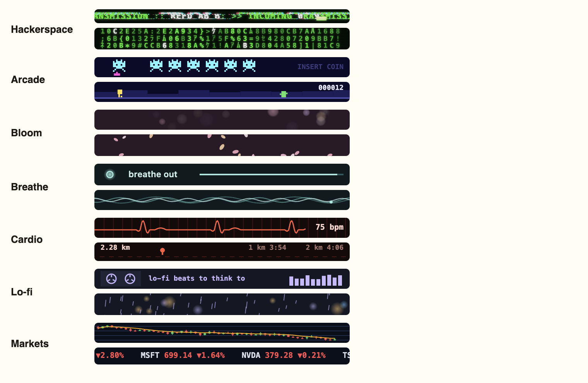

# Beacons

The strip along the top of every card is the beacon, there to catch an attention that drifts. It comes in seven presets, picked from the Beacon item in the menu, which names the one in use, and the choice is kept in `beacon.json` in the app's user data. Switching while a card is up redraws that card at once. Each preset is two or more short canvas animations, one drawn at random per card, in its own palette and with its own cue for flashing the strip's edge.

## Who they follow

The coach is built for young professionals, roughly 25 to 34, and the beacon is the most visible thing about a card, so the presets follow what adults do with their time, using the younger end wherever a survey splits it out. Interests that skew towards women and ones that skew towards men are both covered rather than averaged away. No preset names a demographic. One preset, Hackerspace, follows nobody's survey: it is the author's own taste and was the only beacon before this set existed.

| Preset | What it draws | Who it follows |
| --- | --- | --- |
| Hackerspace | Matrix rain, a decode marquee, a port scan log, and a spectrum analyser when music is loud, all in phosphor green with a CRT flicker | The author |
| Arcade | Space invaders marching above a pixel cannon, and a side-scrolling runner clearing cacti with the score ticking up | Gamers. Play itself is near universal, an average age of 36 and 60 percent of adults weekly in the ESA's 2025 count, but the live-service and competitive side skews male: Deloitte found about half of men who game focus on live-service multiplayer against 29 percent of women, and 69 percent of women prefer simple mobile games |
| Bloom | Petals drifting across the strip, and soft pastel bokeh | Readers and cooks, which skew female. Pew has 78 percent of women reading a book in the past year against 71 percent of men, and YouGov 40 percent of women cooking daily against 31 percent of men |
| Breathe | A ring that grows and shrinks on a four second in, hold, out cycle, and slow layered waves | Yoga, Pilates and journaling, with yoga skewing female. The CDC put yoga in the past year at 23.3 percent of women against 10.3 percent of men, ClassPass had Pilates as its most booked class in 2025, and YouGov found 51 percent of under 30s writing journal entries at least now and then |
| Cardio | A heartbeat trace with a bpm readout, and a running lane ticking off kilometre splits | Runners and gym goers, the most shared interest. Strava had run clubs up 59 percent in 2024 and running as its top sport in 2025, with women 21 percent more likely than men to record a weight session. Gym membership sat at 51.5 percent men in 2024 in the HFA's 2025 report |
| Lo-fi | Rain on a window over city lights with the odd flash of lightning, and a cassette with a VU meter | The chill and cosy aesthetic, shared and tilted female. Chill is Spotify's most streamed mood ever, 55 percent prioritise comfort in Pinterest's 2026 forecast, and Pinterest's audience is about 70 percent female |
| Markets | A stock tape with prices moving in green and red, and a candlestick chart with a moving average | Active investors, which skews male. Gallup finds no gender gap in owning stock at all, but crypto ownership at 25 percent of men aged 18 to 49 against 8 percent of women the same age, and FINRA finds 43 percent of men trading four or more times a year against 26 percent of women |

## Sources

- [ESA, Essential Facts 2025](https://www.theesa.com/annual-esa-study-reveals-video-games-universal-appeal-across-generations/)
- [Deloitte, Digital Media Trends 2024, on female gamers](https://www.deloitte.com/us/en/insights/industry/technology/digital-media-trends-consumption-habits-survey/2024/how-can-gaming-industry-get-more-female-gamers.html)
- [Gallup, stock ownership](https://news.gallup.com/poll/266807/percentage-americans-owns-stock.aspx) and [Gallup, cryptocurrency](https://news.gallup.com/poll/692777/cryptocurrency-limited-main-street-appeal.aspx)
- [FINRA Foundation, investor survey 2024](https://www.finrafoundation.org/sites/finrafoundation/files/2025-11/NFCS_Investor_Survey_Report_White_Paper.pdf)
- [Strava, Year in Sport 2024, as reported by Athletech News](https://athletechnews.com/strava-2024-fitness-report-highlights-trends/) and [Strava, Year in Sport 2025](https://www.prnewswire.com/news-releases/strava-releases-12th-annual-year-in-sport-trend-report-revealing-that-doomscrolling-is-out-movement-is-in-302631107.html)
- [HFA, 2025 consumer report on 2024 membership, as reported by Athletech News](https://athletechnews.com/us-gyms-younger-more-male-hfa-report/)
- [CDC NCHS, yoga in 2022](https://www.cdc.gov/nchs/products/databriefs/db501.htm)
- [ClassPass 2025, as reported by SGB](https://sgbonline.com/pilates-dominates-fitness-bookings-for-classpass-in-2025/)
- [YouGov, journaling 2025](https://yougov.com/en-us/articles/53024-how-often-americans-write-ai-dashes)
- [Pew Research, reading 2025](https://www.pewresearch.org/short-reads/2026/04/09/americans-still-opt-for-print-books-over-digital-or-audio-versions-few-are-in-book-clubs/)
- [YouGov, cooking 2026](https://yougov.com/en-us/articles/54098-food-delivery-takeout-cooking)
- [Spotify, listening trends 2026](https://newsroom.spotify.com/2026-04-23/spotify-20-data-listening-trends/)
- [Pinterest Predicts 2026](https://newsroom.pinterest.com/en-gb/news/pinterest-predicts-nonconformity-self-preservation-and-escapism-drive-21-trends-for-2026/) and [DataReportal, Pinterest audience](https://datareportal.com/essential-pinterest-stats)

## In the code

`src/beacon.js` keeps the list of presets and the saved choice, `src/main.js` puts the Beacon submenu in the tray, `src/coach.js` sends the preset id with every card and pushes a change to a card that is already open, and `src/beacons.js` holds every animation and paints the chosen one on the card's canvas.
