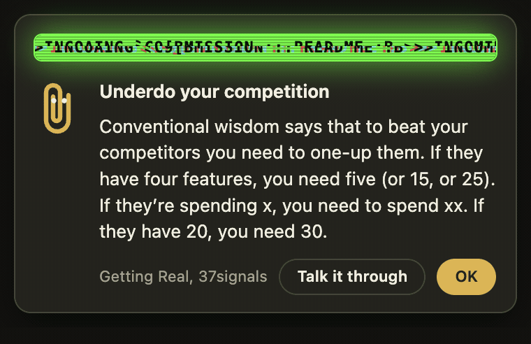

# Flashy

Flashy is the one behind every card. He is Clippy's cousin, the successful one.

Clippy offered to help with a letter and got switched off for it. Flashy watched that happen, read everything he could find, and had himself plated in pure gold. Twenty-four carat, he will tell you, whether or not you asked. He is the gold paperclip in the corner of the card, and the two eyes are his. Every three seconds or so he leans in, because he cannot stand not being looked at.

He is not humble. He knows 366 things about building a SaaS, about attention, motivation and habit, and about looking after your own head while you build, and he intends to tell you every one of them. He never claims to have made any of it up: every card names its source and links back, because being right on the record is the part he enjoys most.

## What he does

Whenever the timer is off and you are at the keyboard, he slides a card into the bottom right corner every four to twelve minutes with one thing he knows. It stays above every window and every Space until you deal with it, and while it is up he runs a beacon along its top edge, a strip of phosphor green animation there to catch an eye that has drifted. Hover the card and he goes quiet so you can read.

He keeps the three subjects in strict rotation, a third each, and inside a subject, once your personal cards are out of the way, he starts with the definitions before the finer points, so nobody can say he skipped the basics.

## What the buttons mean to him

- **Got it.** The expected answer.
- **Talk it through.** Opens a Claude Code session seeded with the card. He is happy to be argued with, because he expects to win.
- **Already know this.** He does not believe you, but he retires the card.
- **Not interested.** He takes it personally, retires the card, and steers the next tune-up away from that angle.
- **More like this.** His favourite button. It keeps the card in play and counts as a vote, and the tune-up and the quiz go deeper wherever the votes are.

## When he asks for help

Once a week he replaces a card with the tune-up. It opens a session that reads what you have been working on, interviews you about your goals, where you are stuck and how you have been sleeping, and rewrites his personal cards around you. He frames this as generosity. It is really so he can be right about you specifically.

Quiz me… in the menu lets him test you on the cards he has shown, mark what you clearly had as known, and rewrite the personal cards around the gaps. He keeps score in `quiz.json`.

He also nags: somewhere you have said a charger is within reach, when the Mac is pulling over 22 W on battery or the battery is under 40 percent, and when a fullscreen window has hidden the menu bar he lives in while the timer is off.

## Where he lives in the code

- `src/popup.html` draws him: the SVG with id `clip`, the gold `--accent`, and the `peek` keyframes that make him lean in.
- `src/coach.js` decides when he speaks and what he says.
- `src/tips.json` is what he knows.
- `feedback.json` in the app's user data is what he remembers about what you thought of it.

